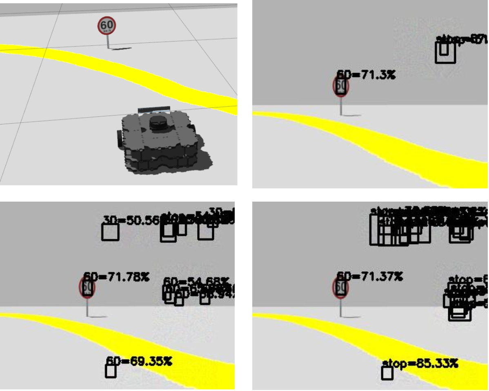
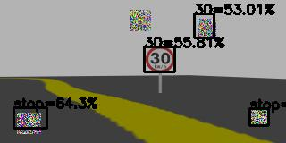
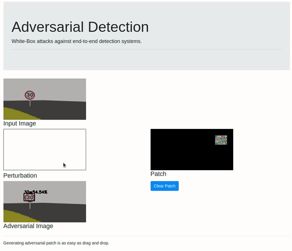
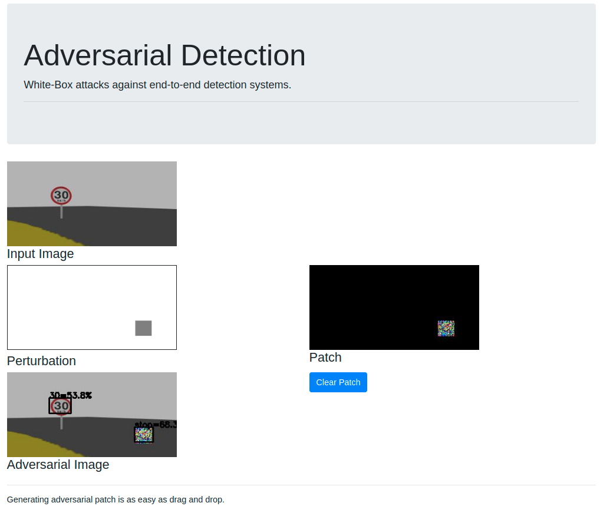

## Adversarial Detection in ROS

> Attacking Object Detection Systems in Real Time



<!--  -->

Generating adversarial patch is as easy as **drag and drop**.



### Quick Start

#### Step 0: Prerequisites

```
$ sudo apt install ros-noetic-desktop-full
$ sudo apt install ros-noetic-rosbridge-suite ros-noetic-turtlebot3-simulations ros-noetic-turtlebot3-gazebo ros-noetic-teleop-twist-keyboard
```

#### Step 1: Setup the TurtleBot

```
$ cd ros_ws
$ rosdep install --from-paths src --ignore-src -r -y

# Please make sure you use the system python3, rather than python from anaconda

$ catkin_make
$ source devel/setup.sh
$ export TURTLEBOT3_MODEL=waffle
$ roslaunch turtlebot3_lane turtlebot3_lane_traffic_signs.launch

# You may need to put the turtlebot on track first
# roslaunch turtlebot3_teleop turtlebot3_teleop_key.launch
```

#### Step 2: Setup the server

Pre-trained models are available here, replace the `weights` folder with: 

https://github.com/wuhanstudio/adversarial-ros-detection/releases/tag/v1.0.0

```
$ cd ros_ws
$ source devel/setup.sh
$ roslaunch turtlebot3_lane rosbridge_websocket.launch

$ # CPU
$ conda env create -f environment.yml
$ conda activate adversarial-ros-detection

$ # GPU
$ conda env create -f environment_gpu.yml
$ conda activate adversarial-ros-gpu-detection

$ cd model

# For Gazebo Simulator
$ python3 detect.py --env gazebo --model weights/keras/yolov4/yolov4-tiny-traffic-3_gazebo.h5

# For real turtlebot3
$ python3 detect.py --env turtlebot --model weights/keras/yolov4/yolov4-tiny-traffic-3_turtlebot.h5
```

**Optional** (test models without attacks):

```
# For real turblebot3
$ python3 detect_cv.py --env turtlebot --cfg weights/darknet/yolov3/yolov3-tiny-traffic-3.cfg --weights weights/darknet/yolov3/yolov3-tiny-traffic-3_turtlebot.weights --classes weights/classes.txt

# For Gazebo Simulator
$ python3 detect_cv.py --env gazebo --cfg weights/darknet/yolov3/yolov3-tiny-traffic-3.cfg --weights weights/darknet/yolov3/yolov3-tiny-traffic-3_gazebo.weights --classes weights/classes.txt
```

#### Step 3: Setup the browser

This is just a website, your can use any web server, just serve all the content under **client/web**.

For Linux and Mac, or other Unix, the server can be built with:

```
$ cd client
$ go install github.com/gobuffalo/packr/v2@v2.8.3
$ go build
$ ./client
```

The web page will be available at: http://localhost:3333/

That's it!




## Adversarial Detection

You can also test our attacks without Gazebo Simulator.

https://github.com/wuhanstudio/adversarial-driving

[](https://github.com/wuhanstudio/adversarial-detection)
