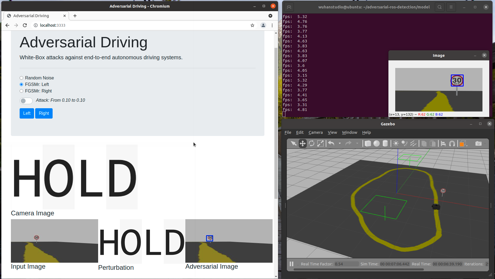

## Adversarial Detection in ROS

> Attacking End-to-End Object Detection Systems




```
./darknet detector train data/obj.data cfg/yolov3-tiny-traffic.cfg yolov3-tiny.conv.11
```

k

```
python tools/model_converter/convert.py cfg/yolov4-tiny.cfg weights/yolov4-tiny.weights weights/yolov4-tiny.h5
```


Train

```
./darknet detector train data/obj.data cfg/yolov4-tiny-traffic.cfg yolov4-tiny.conv.29
```

Convert darknet yolov4-tiny model to keras model:

```
python3 tools/model_converter/convert.py cfg/yolov4-tiny-traffic.cfg weights/yolov4-tiny-traffic.weights weights/yolov4-tiny-traffic.h5
```


Train yolov4 mobilenet lite:

```
python3 train.py --model_image_size=160x320 --model_type=yolo4_mobilenet_lite --anchors_path=configs/yolo4_anchors.txt --annotation_file=trainval.txt --classes_path=obj.names --eval_online --save_eval_checkpoint
```

Save model as keras:

```
python3 yolo.py --model_type=yolo4_mobilenet_lite --weights_path=logs/000/ep085-loss1.603-val_loss1.949.h5 --anchors_path=configs/yolo4_anchors.txt --classes_path=obj.names --model_image_size=160x320 --dump_model --output_model_file=model.h5
```

Test the model:

```
python3 yolo.py --model_type=yolo4_mobilenet_lite --weights_path=model.h5 --anchors_path=configs/yolo4_anchors.txt --classes_path=obj.names --model_image_size=160x320 --image
```

